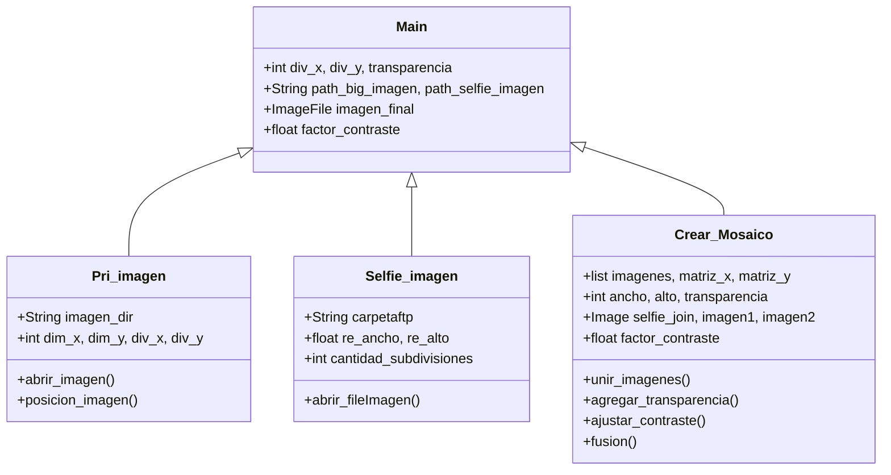

# 
Foto Mosaico con Python

**Foto_Mosaico** es un Script desarrollado en **Python 3.12.3**, consiste en contar con un banco de fotografías o selfies las cuales serán sobrepuestas con una fotografia mas grande obteniendo un mosaico de fotografias.

***
### Diagrama

***Pri_imagen:*** es la clase que se encarga de procesar la imagen de fondo o la imagen principal, de esta imagen se necesita obtener sus dimensiones para crear las subdivisiones donde se colocaran las imagenes selfies. La cantidad de selfies a colocar para crear el mosaico lo determinara el usuario.  
***Selfie_imagen:*** es la clase que se encarga de procesar las imagenes selfies, estas imagenes estaran alojadas en una carpeta, la cantidad de imagenes alojadas sera determinada por el usuario. La clase detectará la cantidad de imagenes existentes y las necesarias para crear el mosaico y tambien cambiará el tamaño de la imagen para ocupar cada cuadricula del mosaico.
***Crear_Mosaico:*** en esta clase es donde se sucede la magia, une todas las imagenes de selfies tomando encuenta las dimensiones de la imagen principal y la cantidad que se va a colocar en la dirección X e Y. Para una mejor vizualización del resultado final se ha colocado dos funciones que ayudan con la transparencia y el contraste de la imagen. Finalmente se unen las dos imagenes colocando la imagen de fondo o la imagen principal en la parte de atrás y la imagen creada a partir de las selfies en la parte de enfrente. Como resultado se tiene una nueva imagen que puede ser guardada para su posterior uso.
***
### Bibliotecas Utilizadas
*PIL(Pillow), OS, Random, Colorama*

### Sitios de Consulta
* [How to Install Pillow on Linux?](https://www.geeksforgeeks.org/how-to-install-pillow-on-linux/)
* [Entornos virtuales y paquetes](https://docs.python.org/es/3/tutorial/venv.html)
* [Fundamentos para procesar imágenes con Pillow (I)](https://python-para-impacientes.blogspot.com/2014/12/fundamentos-para-procesar-imagenes-con.html)
* [Listas (arrays, arreglos o vectores) en Python. Uso y creación de listas en Python](https://www.programarya.com/Cursos/Python/estructuras-de-datos/listas)

***

